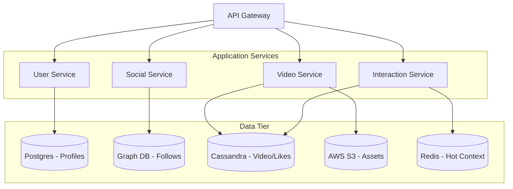
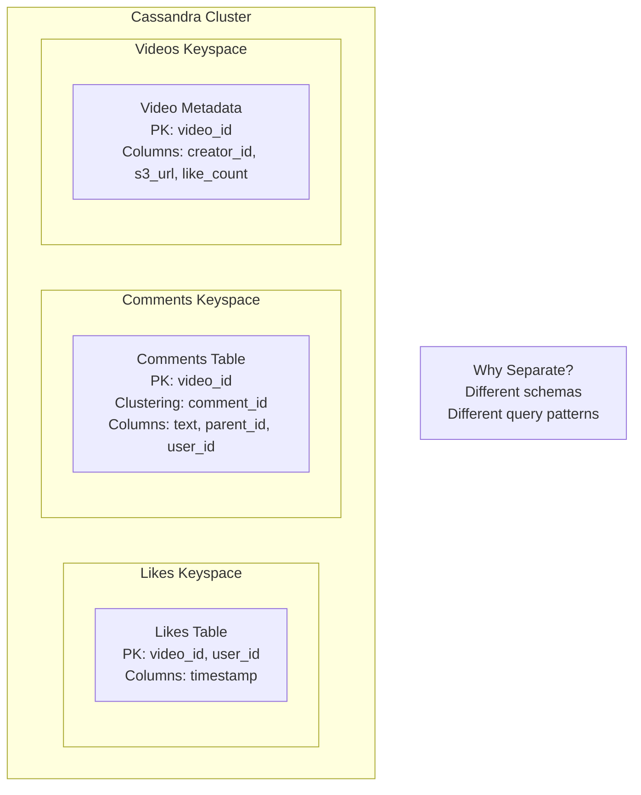
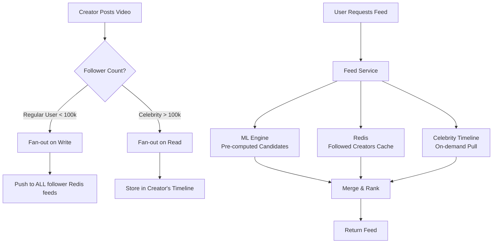
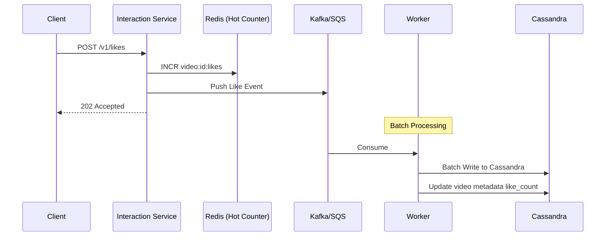
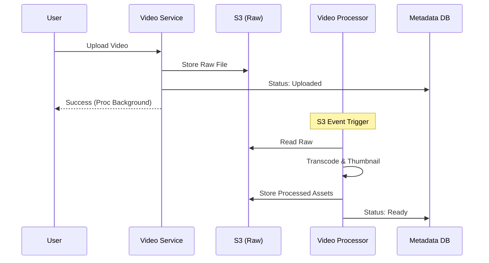
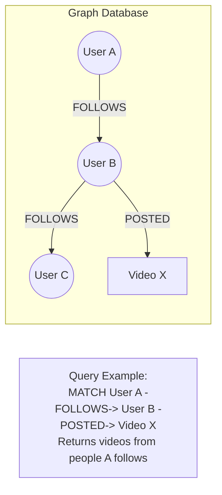

# TikTok Master Architectural Diagrams

This document is your visual guide for the TikTok system design, ranging from high-level flows to detailed data models.

---

## 1. High-Level System Overview

---

## 2. High-Level Data Tier (Polyglot Persistence)

---

## 3. Cassandra Data Model (Separate Tables)

---

## 4. Feed Strategy: Hybrid Fan-out

---

## 5. The "Like" Flow (High-Throughput Write Path)

---

## 6. Video Upload & Processing Flow

---

## 7. Social Graph Traversal (Graph DB)

---

## Key Takeaways for Interview

1. **R-S-G-C**: Your memory anchor for the stack
2. **Separate Cassandra Tables**: Likes and Comments have different schemas
3. **Hybrid Fan-out**: Write for regular users, Read for celebrities
4. **Write-Back Cache**: Redis + Kafka to handle viral spikes
